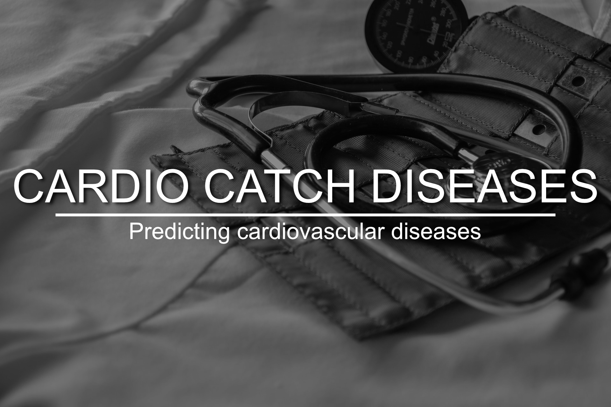

# Cardio Catch Diseases

## Predicting cardiovascular diseases

# 1. Business Problem.

Cardio Catch Diseases is a company specialized in detecting heart disease in the early stages. Its business model lies in offering an early diagnosis of cardiovascular disease for a certain price.

Currently, the diagnosis of cardiovascular disease is manually made by a team of specialists. The current accuracy of the diagnosis varies between 55% and 65%, due to the complexity of the diagnosis and also the fatigue of the team who take turns to minimize the risks. The cost of each diagnosis, including the devices and the payroll of the analysts, is around $1,000.00.

The price of the diagnosis, paid by the client, varies according to the precision achieved by the team of specialists.

| Exam Accuracy | Price          | Rules                                    | Example                         |
|:--------------|:---------------|:-----------------------------------------|:--------------------------------|
| Above 50%     | min \$500\.00  | \+\$500 for each additional 5% precision | Precision = 55% \-> \$1,000\.00 |
| Up to 50%     | $0\.00         | N/A                                      | N/A                             |

Thus, we see that **different values in the exam precision**, given by the team of specialists, make the company either have a profitable operation, revenue greater than the cost, or an operation with a loss, revenue less than the cost. This instability of the diagnosis makes the company to have an **unpredictable cashflow**.

# 2. Business Assumptions.

The assumptions about the business problem is as follows:

- **CVDs are the number 1 cause of death globally**: more people die annually from CVDs than from any other cause.
- An estimated **17.9 million** people died from CVDs in 2016, representing 31% of all global deaths. Of these deaths, 85% are due to heart attack and stroke.
- Over three quarters of CVD deaths take place in **low- and middle-income countries**.
- Out of the **17 million** premature deaths (under the age of 70) due to noncommunicable diseases in 2015, **82%** are in low- and middle-income countries, and 37% are caused by CVDs.
- Most cardiovascular diseases can be **prevented by addressing behavioural risk factors** such as tobacco use, unhealthy diet and obesity, physical inactivity and harmful use of alcohol using population-wide strategies.
- People with cardiovascular disease or who are at high cardiovascular risk (due to the presence of one or more risk factors such as hypertension, diabetes, hyperlipidaemia or already established disease) **need early detection and management** using counselling and medicines, as appropriate.

PS 1: All the references are stated at the end of this README.

PS 2: You can find useful information at **section 1** of my [notebook](#).

# 3. Solution Strategy

My strategy to solve this challenge was:

**Step 01. Data Description:** My goal is to use statistics metrics to identify data outside the scope of business.

**Step 02. Feature Engineering:** Derive new attributes based on the original variables to better describe the phenomenon that will be modeled.

**Step 03. Data Filtering:** Filter rows and select columns that do not contain information for modeling or that do not match the scope of the business.

**Step 04. Exploratory Data Analysis:** Explore the data to find insights and better understand the impact of variables on model learning.

**Step 05. Data Preparation:** Prepare the data so that the Machine Learning models can learn the specific behavior.

**Step 06. Feature Selection:** Selection of the most significant attributes for training the model.

**Step 07. Machine Learning Modelling:** Machine Learning model training

**Step 08. Hyperparameter Fine Tunning:** Choose the best values for each of the parameters of the model selected from the previous step.

**Step 09. Convert Model Performance to Business Values:** Convert the performance of the Machine Learning model into a business result.

**Step 10. Deploy Modelo to Production:** Publish the model in a cloud environment so that other people or services can use the results to improve the business decision.

# 4. Top 3 Data Insights

**Hypothesis 01:** The cases of heart diseases does not significantly depend on the height.

**False.** As observed, up to ~165 cm there are significantly more cases of heart diseases. Then, above this height, there are fewer cases.

**Hypothesis 02:** The are more cases of heart diseases for people who smokes than for people who does not.

**False.** As observed, the great majority of cases are among people who doesn't smoke.

**Hypothesis 03:** The are more cases of heart diseases for people who intakes alcohol than for people who does not.

**False.** As observed, the great majority of cases are among people who doesn't intake alcohol.

# 5. Machine Learning Model Applied
Tests were made using different algorithms.

# 6. Machine Learning Modelo Performance
The chosen algorithm was the **CatBoost Classifier**. In addition, I made a performance calibration on it.

#### Precision, Recall, ROC AUC and other metrics

These are the metrics obtained from the test set.

| precision | recall  | f1\-score | roc auc | cohen kappa | accuracy |
|-----------|---------|-----------|---------|-------------|----------|
| 0\.7350   | 0\.7313 | 0\.7331   | 0\.7951 | 0\.4605     | 0\.7303  |

The summary below shows the metrics comparison after running a cross validation score with stratified K-Fold with 10 splits in the full data set.

|                                            | Avg Precision             | Avg Recall                | Avg f1\-score             | Avg ROC AUC               |
|--------------------------------------------|---------------------------|---------------------------|---------------------------|---------------------------|
| LGBM Classifier                            | 0\.7535 \(\+/\- 0\.0087\) | 0\.7021 \(\+/\- 0\.0117\) | 0\.7269 \(\+/\- 0\.0095\) | 0\.7977 \(\+/\- 0\.0090\) |
| LGBM Classifier \(Tuned HP\)               | 0\.7522 \(\+/\- 0\.0080\) | 0\.7039 \(\+/\- 0\.0144\) | 0\.7272 \(\+/\- 0\.0092\) | 0\.7967 \(\+/\- 0\.0076\) |
| LGBM Classifier \(Tuned HP \+ Calibrated\) | 0\.7557 \(\+/\- 0\.0103\) | 0\.7002 \(\+/\- 0\.0163\) | 0\.7269 \(\+/\- 0\.0097\) | 0\.7974 \(\+/\- 0\.0078\) |

Although the **Tuned HP + Calibrated** model has a slightly lower f1-score and recall, it has a higher precision which is fair enough for our project needs. In addition, for being calibrated, in the future predictions it will be more stable and confident which is good for both business and patients.

# 7. Business Results

Let's recap the pricing model. The price of the diagnosis, paid by the client, varies according to the precision achieved by the team of specialists.

| Exam Accuracy | Price          | Rules                                    | Example                         |
|:--------------|:---------------|:-----------------------------------------|:--------------------------------|
| Above 50%     | min \$500\.00  | \+\$500 for each additional 5% precision | Precision = 55% \-> \$1,000\.00 |
| Up to 50%     | $0\.00         | N/A                                      | N/A                             |

Our full original data set contains the records of 70,000 patients. Suppose we were to make them go through the clinic procedure to check if they have a cardiovascular disease, our model have reached a **precision** that ranges **from 74.54% to 76.6%**, which is higher than the 55% to 65% that we have on today's procedures. Thus, translating it to business numbers.

|                        | Best              | Worst             |
|:-----------------------|------------------:|------------------:|
| Our model (TO BE)      | \$186,164,981.89  | \$171,777,607.99  |
| Today (AS IS)          | \$105,000,000.00  | \$35,000,000.00   |

This means that having a portfolio of 70k patients that would go through the clinical procedure to check whether they have or not a cardiovascular disease, in the **worst business scenario** the portfolio would generate a profit of **\$171.7 million** and in the **best scenario \$186.2 million**, in contrast to today's procedure that at its best has an accuracy of 65% and would generate a total of \$105 million, that's **a difference of \$81.2 million!**

# 8. Conclusions

# 9. Lessons Learned

# 10. Next Steps to Improve

**1.** **Develop an app** that intakes a portfolio of patients and assigns for each patient its respective probability of presenting a cardiovascular disease.

**2.** **Run a Design Discovery** to uncover facts that could be missing in our analysis in order to enrich the data that we have and improve the model performance.

**3.** Build a **model retraining pipeline**.

